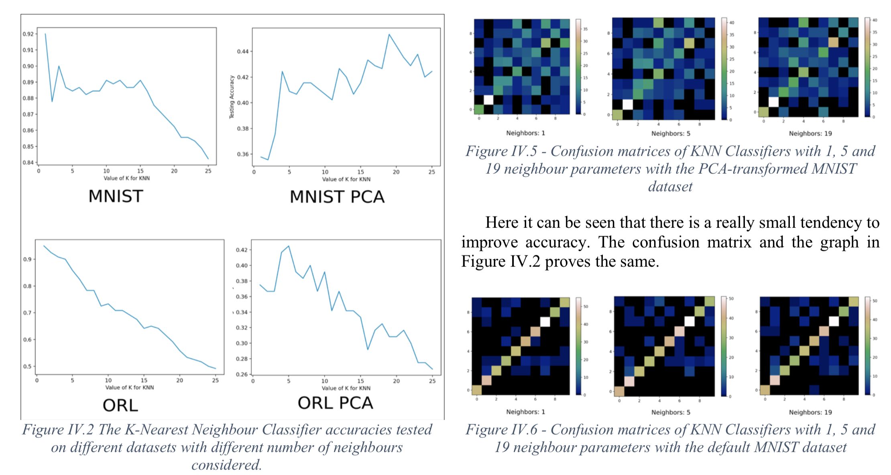

# Machine Learning (Classification) with Python
This was a University project for Optimization and Data Analysis, Aarhus University.

## This project compares three classification schemes:
1. K-Nearest Neighbours Classifier
2. Nearest Sub-Class Centroid Classifier
3. Nearest Centroid Classifier 

### Special thanks to [Gronne](https://github.com/gronne) for the Sub-Class Centroid Classifier.

# Results

